# volume7assignment
Daily reminder assignment to prove potential employer I'm not lying on my resume

## Sequence Diagram
Github doesn't support mermaid, but you can use this chrome extension to see the mermaid graph !

Note: Doesn't work well with the dark theme unfortunately :(

[Github + Mermaid](https://chrome.google.com/webstore/detail/github-%2B-mermaid/goiiopgdnkogdbjmncgedmgpoajilohe/related?hl=en-US)

```mermaid
sequenceDiagram
    participant FE as User (FE)
    participant BE
    participant SG as Sendgrid
    alt Sign up
        FE ->>+ BE: [POST] /signup
        activate BE
        alt
            BE -->> FE: 200 OK
        else
            BE -->> FE: 401 Unauthorized<br>(Already exists)
        deactivate BE
        end
    else Login
        FE ->> BE: [POST] /login
        activate BE
        BE ->> BE: Validate credentials
        alt
            BE -->> FE: 200 OK<br>(Issued JWT)
        else
            BE -->> FE: 401 Unauthorized<br>(Invalid credentials)
        deactivate BE
        end
    else Forgot
        FE ->> BE: [POST] /forgot<br>(email attached)
        activate BE
            BE ->> SG: Send mail
            activate SG
                SG -->> BE: OK
            deactivate SG
            BE -->> FE: OK
        deactivate BE
    else Reset
        FE ->> BE: [POST] /reset<br>(JWT attached)
        activate BE
        BE ->> BE: Validate JWT
        alt Valid
            BE -->> FE: 200 OK
        else Invalid
            BE -->> FE: 403 Forbidden
        deactivate BE
        end
    else Reminders
        FE ->> BE: [GET] /reminders
        activate BE
        BE ->> BE: Validate JWT
        alt Valid
            BE -->> FE: 200 OK<br>(list of reminders attached)
        else Invalid
            BE -->> FE: 403 Unauthorized
        deactivate BE
        end
        FE ->>+ BE: [POST] /reminders<br>(new reminder attached)
        BE -->>- FE: 201 OK<br>(record attached)
        FE ->> BE: [PATCH] /reminders/{id}
        activate BE
        alt Found
            BE -->> FE: 200 OK<br>(updated record attached)
        else Not Found
            BE -->> FE: 404 Not Found
        deactivate BE
        end
        FE ->> BE: [DELETE] /reminders/{id}
        activate BE
        alt Found
            BE -->> FE: 200 OK
        else Not Found
            BE -->> FE: 404 Not Found
        deactivate BE
        end
    else Send mail
        BE ->> BE: timer fired
        activate BE
        BE ->> BE: Gather reminders
        BE ->> BE: Sort by user
        BE ->> BE: Prepare Batch emails
        loop
            BE ->>+ SG: Send Batch
            SG -->>- BE: OK
        end
        deactivate BE
    else Update mail interval (utility function)
        FE ->>+ BE: [PATCH] /interval
        Note over FE,BE: Not really the FE, just HTTP call to BE
        BE -->>- FE: 200 OK
    end
```

